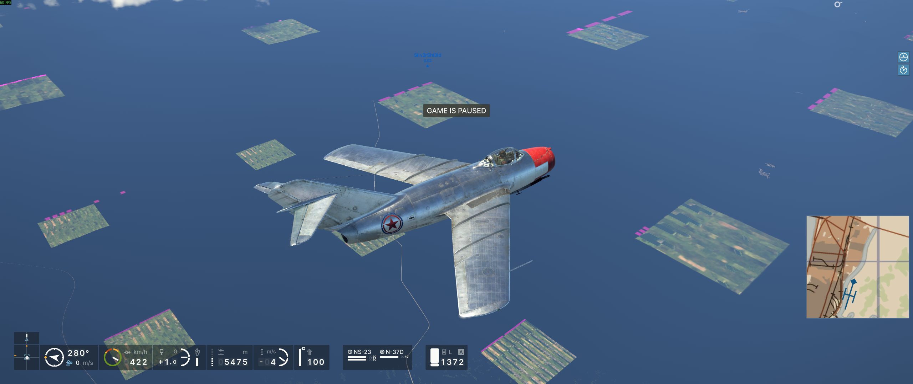
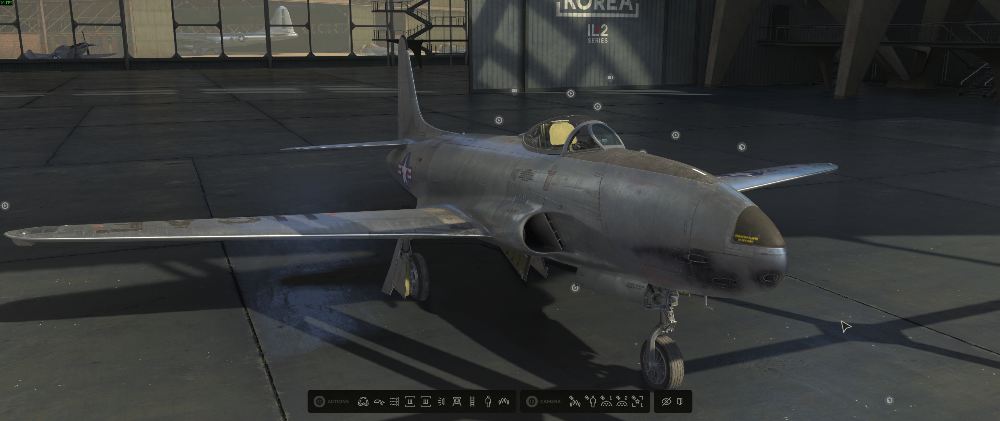

# IL-2 Korea Proton compatibility investigation

This repository contains the reproducible evidence behind three independent
compatibility fixes for **Korea. IL-2 Series** (Steam AppID 247970): startup
through Wine, terrain uploads through VKD3D-Proton, and tiled-light allocation
through paired dxil-spirv and VKD3D-Proton changes.

> [!IMPORTANT]
> This is an investigation and upstream evidence repository, not a game mod.
> The fixes have been validated without launch parameters or game-file
> modification, but upstream review and release integration are still in
> progress. A fix being proven here does not mean it is already available in
> standard Proton.

## Status at a glance

| Problem | Proven cause | Upstream path | Status on 2026-08-10 |
| --- | --- | --- | --- |
| Startup abort or need for OpenMP launch options | Wine's public NUMA queries did not expose the processor topology already known internally | [Wine MR !11604](https://gitlab.winehq.org/wine/wine/-/merge_requests/11604) | Exact six-commit series validated with empty Steam launch options. The same series is in [Valve's Wine fork](https://github.com/ValveSoftware/wine/compare/c3007e6f2a36914cc55301eb5efd067707bf8bb1...99166a7e25b08ccef0168217540542260eaed76f) and the [Proton Bleeding Edge source branch](https://github.com/ValveSoftware/Proton/commit/d28e7f2c40da279452db93897c5b9c2c84356fac), but the Wine MR remains open and standard Proton branches were still pinned before it at the final check |
| Missing or magenta terrain pages | Placed-buffer geometry stayed in uncompressed source texels instead of being converted to BC3 destination block geometry | [VKD3D-Proton PR #3202](https://github.com/HansKristian-Work/vkd3d-proton/pull/3202) | General three-file fix with a regression test, merged as `731c4aae`, and independently confirmed on another system |
| Flashing square lighting blocks | A 32-bit global atomic through an `R16_UINT` typed UAV corrupted the tiled-light reference allocator | Paired dxil-spirv legalization and capability-gated VKD3D-Proton integration; [initial PR #3207](https://github.com/HansKristian-Work/vkd3d-proton/pull/3207) records the first implementation and maintainer feedback | ABI-safe D49 candidate validated locally with empty launch options. Upstream redesign and review remain in progress |

The current public summary is in
[Proton issue #9906](https://github.com/ValveSoftware/Proton/issues/9906#issuecomment-5238316414).
The complete technical conclusions, exact hashes, and evidence boundaries are
in [`docs/final-report.md`](docs/final-report.md).

## Public handoff

- [Consolidated Proton status](https://github.com/ValveSoftware/Proton/issues/9906#issuecomment-5238316414)
- [Wine/NUMA startup validation](https://github.com/ValveSoftware/Proton/issues/9906#issuecomment-5218434565)
- [VKD3D-Proton tiled-light root-cause report](https://github.com/HansKristian-Work/vkd3d-proton/issues/3134#issuecomment-5238151028)
- [Terrain PR #3202](https://github.com/HansKristian-Work/vkd3d-proton/pull/3202)
- [Initial lighting PR #3207 and maintainer review](https://github.com/HansKristian-Work/vkd3d-proton/pull/3207)
- [Early diagnostic handoff from 2026-08-06](https://github.com/silv3rshi3ld/il2-korea-proton-investigation/releases/tag/handoff-2026-08-06)

## What the investigation proved

### Startup without hard-coded processor values

The game ships Intel's OpenMP runtime. During initialization it asks Windows
which processors belong to each NUMA node. Wine detected the host topology but
returned an unimplemented result through the queried public API. OpenMP treated
that result as fatal.

The exact six commits from Wine MR !11604 expose the runtime topology through
the missing APIs. A full Steam launch succeeded with an empty launch-options
field, no `KMP_*`, `OMP_*`, or `WINE_CPU_TOPOLOGY` setting, and affinity
controls allowing 1, 2, 4, 8, and 16 CPUs. OpenMP reported the corresponding
available count in every case. No CPU vendor, game, AppID, or thread count is
encoded in the implementation.

See [`docs/evidence-n05-wine-mr-11604.md`](docs/evidence-n05-wine-mr-11604.md).

### Terrain-page corruption

IL-2 uploads a `64x64 R32G32B32A32_UINT` placed footprint as the physical data
for a `256x256 BC3_UNORM` terrain page. Both physical elements are 16 bytes, so
one source texel represents one 4x4 BC3 block. VKD3D-Proton retained the source
geometry and populated only one sixteenth of the destination page.

The merged general fix converts equal-sized physical elements through their
block geometry. It contains no IL-2 executable or AppID check. A gated causal
test adjusted 522 of 522 observed page and border copies with zero rejects; a
clean build restored the terrain at multiple altitudes. The PR artifact was
also [confirmed by another user](https://github.com/ValveSoftware/Proton/issues/9906#issuecomment-5237490788).

The images below are representative observations from different controlled
runs and viewpoints. They are not presented as a matched frame-for-frame A/B.

| Corrupted baseline | Repaired by the general copy fix |
| --- | --- |
|  |  |

See [`docs/evidence-d08-result.md`](docs/evidence-d08-result.md) and
[`docs/evidence-pr-scope-refinement.md`](docs/evidence-pr-scope-refinement.md).

### Tiled-light blocks and broad flashing

The game's `ComputeLightsFirstRef` shader performs a 32-bit atomic through an
`R16_UINT` typed UAV. Native D3D12 drivers tolerate that application mismatch,
but a literal Vulkan typed-buffer path cannot legally represent the access.
All 50 workgroups reused offsets 0 through 320 while the frame requested
12,126 references. Between adjacent frames, 69 to 107 overwritten light IDs
changed, explaining both the rectangular screen tiles and their broad flicker.

The current D49 design divides the compatibility behavior at the component
boundary. dxil-spirv keeps the semantic resource as a typed buffer, but exposes
an effective raw-buffer binding to the remapper only while selecting a
descriptor. It accepts that path only when the remapper returns an SSBO;
otherwise it restores and retries the ordinary typed mapping. VKD3D-Proton
enables the exact `IL2Series.exe` shader quirk only when a raw SSBO sibling is
available and the mutable-single-set layout is not active. Unsupported layouts
therefore retain the typed fallback instead of interpreting a texel-buffer
descriptor as an SSBO.

The lowering is limited to eligible 32-bit atomic typed UAVs. It does not lower
64-bit atomics, sparse resources, or non-atomic typed UAVs, and it does not
bypass the game's depth predicates. D49 retained real lighting and shadows.
The fine sandy or film-grain lighting visible in motion is also present on
native Windows and is not part of this defect.

The following historical matched A/B established the required runtime behavior.
Its one-commit VKD3D-Proton implementation was later superseded by the
compiler-aware D49 architecture, but the images remain valid mechanism and
visual evidence. Both U01 tools use the same NUMA-capable Wine base and differ
only in their four VKD3D-Proton DLLs.

| Before: unmodified master `84c87c83` | After: candidate `9b6e15be` |
| --- | --- |
|  |  |

The still image catches a relatively faint corrupted frame. The blocks flashed
repeatedly and were more pronounced during normal runtime.

D49 then reproduced the clean result using the ABI-safe paired implementation.
The correct D49 process path was verified, Steam launch options were empty, and
the menu, a short flight, terrain, and the map all rendered correctly without
the blocks or broad flicker.

See [`docs/evidence-d49-compiler-aware-result.md`](docs/evidence-d49-compiler-aware-result.md),
[`docs/evidence-u01-upstream-candidate-ab.md`](docs/evidence-u01-upstream-candidate-ab.md),
and [`docs/evidence-d47-allocator-only-wired-result.md`](docs/evidence-d47-allocator-only-wired-result.md).

## Evidence map

- [`docs/final-report.md`](docs/final-report.md): final technical report and
  current upstream status
- [`docs/README.md`](docs/README.md): curated evidence index and archive map
- [`patches/README.md`](patches/README.md): diagnostic history, historical
  patch identities, and current D49 publication status
- [`docs/reproduction.md`](docs/reproduction.md): controlled reproduction and
  safety procedure
- [`docs/experiment-matrix.md`](docs/experiment-matrix.md): complete test
  chronology, including negative and invalid controls
- [`docs/findings.md`](docs/findings.md): chronological findings ledger
- [`PROVENANCE.md`](PROVENANCE.md): authorship, upstream provenance, and
  distribution boundaries

The repository intentionally retains failed tests and false leads. They show
which mechanisms were excluded and prevent the successful results from being
mistaken for coincidental configuration changes.

## Verified final environment

- CPU topology: 16 logical CPUs in one host NUMA node
- GPU: AMD Radeon RX 7800 XT
- Mesa/RADV: 26.1.6
- Game build: 24615759
- Lighting baseline: VKD3D-Proton `84c87c83`
- ABI-safe lighting candidate: local dxil-spirv commit `afff4dfb` on base
  `edd8fdf7`, with the dependent VKD3D-Proton integration on base `731c4aae`
- Terrain fix: merged in VKD3D-Proton `731c4aae`
- Wine MR head validated through Proton: `e8319c0e6bfe7f94512218b48e3158e0c286b481`

This hardware coverage proves the reported mechanisms and removes hard-coded
host assumptions. It does not replace upstream review or cross-vendor runtime
testing.

## Reproducing or resuming

Do not alter a Proton prefix until a backup exists and Steam and the game are
fully stopped. Start with [`docs/reproduction.md`](docs/reproduction.md) and
the safety-aware scripts under [`scripts/`](scripts/).

Generated captures, prefixes, game assets, credentials, shader caches, custom
Proton packages, and unfiltered large traces are not committed. The final
evidence release is generated only from an explicit allowlist of reviewed
files.
