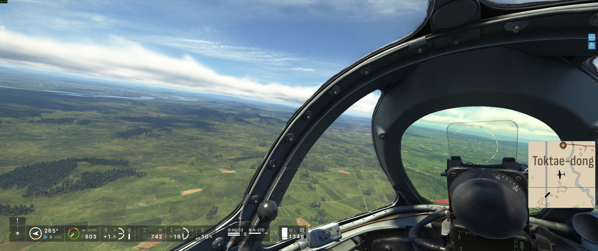
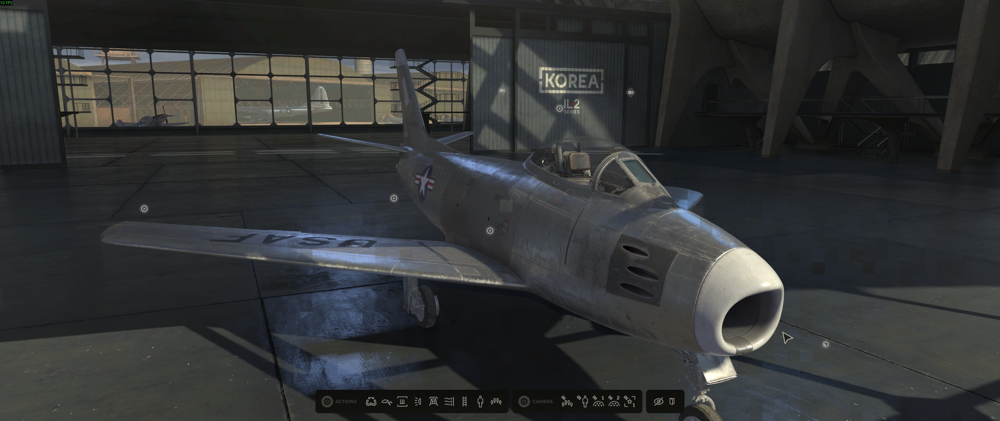
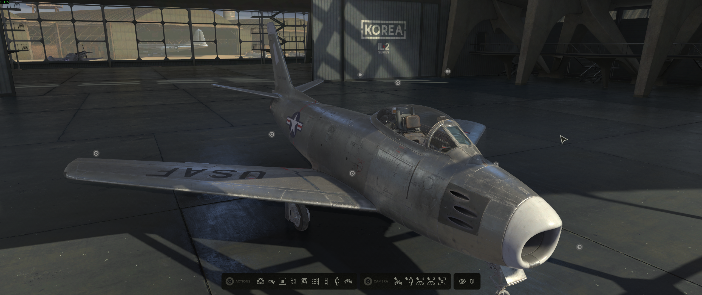

# IL-2 Korea Proton compatibility investigation

This repository tracks a controlled investigation of **Korea. IL-2 Series**
(Steam AppID 247970). It deliberately separates the startup/NUMA failure, the
terrain corruption, and the tiled-light corruption. The terrain remedy is a
general copy fix; the lighting remedy is a narrowly scoped VKD3D-Proton shader
quirk. Neither requires launch parameters or game modification.

## Public handoff

- [ValveSoftware/Proton #9906](https://github.com/ValveSoftware/Proton/issues/9906#issuecomment-5216217531)
- [VKD3D-Proton #3134](https://github.com/HansKristian-Work/vkd3d-proton/issues/3134#issuecomment-5216216401)
- [VKD3D-Proton PR #3202](https://github.com/HansKristian-Work/vkd3d-proton/pull/3202)
- [Sanitized logs and focused evidence bundle](https://github.com/silv3rshi3ld/il2-korea-proton-investigation/releases/tag/handoff-2026-08-06)

The release bundle is intentionally small. It contains filtered/redacted logs,
the BC3 trace excerpt, analysis, diagnostic patches, hashes, and one labeled
comparison screenshot. It contains no game packages, prefix, credentials,
shader cache, or unfiltered large trace.

## Current status

All three compatibility problems now have isolated outcomes:

- Startup without parameters is fixed by the Wine NUMA API work from upstream
  MR !11604. It uses the processor topology reported at runtime and contains no
  hard-coded thread count. The custom Proton build in this repository was only
  used to validate the exact upstream series; no duplicate Wine or Proton patch
  is proposed here. The intended long-term path is MR !11604 flowing from Wine
  into Proton through the normal update process.
- Terrain-page corruption is fixed by general VKD3D-Proton copy-unit commit
  `64ec55e7`, proposed as PR #3202. It has no IL-2 application override.
- Menu, cockpit, external-view, and fire-lit blocks/flicker are fixed by the
  allocator-only D47 behavior. The local clean upstream candidate is commit
  `9b6e15be` on branch `fix-il2-tiled-light-allocator`: 29 added lines, scoped
  to `IL2Series.exe` and exact shader `7cefa1bc80bb4c70`.

## Terrain corruption

The terrain result is the separate general copy-unit fix proposed in
VKD3D-Proton PR #3202. It converts equal-sized physical elements through their
block geometry, restoring complete BC3 terrain pages without an IL-2-specific
override.



## Tiled-light blocks and flashing

The lighting root cause is a 32-bit global atomic issued through an `R16_UINT`
typed UAV. Native Windows drivers tolerate that application mismatch, while a
literal Vulkan typed-buffer path makes all 50 workgroups reuse offsets 0–320
for a frame requesting 12,126 references. Adjacent affected frames overwrite
69–107 light IDs differently, producing both stable screen-tile boundaries and
temporal flicker. VKD3D-Proton already provides a raw storage-buffer sibling
for the descriptor. The fix lowers this exact shader's access as an SSBO and
selects that raw descriptor sibling.

D47 retains the game's original tiled-light depth predicates. With empty Steam
launch options, its verified package removes the blocks and broad flicker while
real lighting and shadows remain. This proves that the earlier D38 depth-gate
bypass only hid the presentation of malformed membership data and is not part
of the fix. D46 is not a contrary result: source review found that its
executable mapping had accidentally been removed, so its allocator quirk never
activated. The remaining fine sandy or film-grain lighting is also present on
native Windows and is not treated as a Proton defect.

The same result is now reproduced in a fresh matched A/B between unmodified
upstream master `84c87c83` and the clean candidate `9b6e15be`. The static
Before screenshot understates the severity because the blocks were flashing
during runtime; the candidate removes both the blocks and broad flashing. The
clean lighting patch remains local pending upstream review. See
[`docs/evidence-d47-allocator-only-wired-result.md`](docs/evidence-d47-allocator-only-wired-result.md)
and
[`docs/evidence-u01-upstream-candidate-ab.md`](docs/evidence-u01-upstream-candidate-ab.md).

In principle the game should use a legal 32-bit UAV for this atomic. In
practice, compatibility layers also need to reproduce Windows driver tolerance
for already shipped software. The proposed compromise is therefore not a new
lighting engine or a broad relaxation: it is one exact executable and shader
compatibility quirk that routes the existing operation through the legal raw
storage-buffer path.

### Before — unmodified VKD3D-Proton master `84c87c83`



The still image catches a relatively faint frame; during normal runtime these
rectangular blocks flashed repeatedly and were more pronounced.

### After — allocator-only candidate `9b6e15be`



The matched candidate view retains real lighting and shadows without the
blocks or broad flashing. The fine sandy or film-grain lighting is normal on
Windows and is not considered part of this defect.

## Verified environment

- Launch executable: `bin/game/IL2Series.exe`
- Steam library: `/home/USER/.local/share/Steam`
- Game directory: `/home/USER/.local/share/Steam/steamapps/common/IL2Series`
- Prefix: `/home/USER/.local/share/Steam/steamapps/compatdata/247970`
- Game build ID: `24615759` (Steam auto-update on 2026-08-07; the immediately
  preceding controlled build was `24596901`)
- Fresh A/B compatibility tools: `IL2-Korea-PR-Baseline-84c87c83` and
  `IL2-Korea-PR-Candidate-9b6e15be`, built on the same NUMA-capable D42 Wine
  base (`11.0-100` prefix) and differing only in their four VKD3D DLLs
- N05 upstream-series validation tool:
  `IL2-Korea-D10-WineMR11604-Proton11`, based on the same Proton 11 family and
  D08 terrain tool with the 64-bit Wine components affected by MR !11604
- Tested VKD3D-Proton lighting commit: `f3e06d0b` (D47 diagnostic branch,
  including the D08 terrain behavior)
- Clean standalone lighting candidate: `9b6e15be` (current upstream master
  base `84c87c83`)
- DXVK commit: `1a5919b7edd111887648d1e8bf0c32733e2e00d3`
- Mesa/RADV: `26.1.6` (`Mesa 26.1.6-arch3.1`)

`IL2Series.exe` imports the game's `dxBackend12.dll`. That backend imports
`d3d12.dll` and `dxgi.dll`; the prefix copies hash-identically to the selected
Proton build's 64-bit VKD3D-Proton D3D12 DLLs and DXVK DXGI DLL. A DXVK
`d3d11.dll` is installed in the prefix but is not statically imported by the
D3D12 backend. The completed controlled runtime logs with module evidence load
DXGI, D3D12, D3D12Core, and `dxBackend12.dll`, with no D3D11 module load.

The historical startup mitigation was:

```text
OMP_NUM_THREADS=16 KMP_AFFINITY=disabled %command%
```

It is no longer required with the exact MR !11604 D10 build on the reporting
host. An
isolated matrix with the game's exact `libiomp5md.dll` establishes that
`KMP_AFFINITY=disabled` was the necessary workaround component:
`OMP_NUM_THREADS=16` alone still fails, while affinity disabled succeeds
without a fixed thread count. The proposed Wine fix contains neither value.
See
[`docs/startup-numa-assessment.md`](docs/startup-numa-assessment.md) and
[`docs/evidence-n05-wine-mr-11604.md`](docs/evidence-n05-wine-mr-11604.md).

Controlled baseline E00 is complete across two runs and reproduces both
reported graphics signatures: block artifacts on the rendered menu aircraft
and severe rectangular-page terrain loss with magenta edges in flight. Runtime logging
confirms the D3D12 path and active host-visible upload, descriptor-buffer, and
multi-queue paths. The later D07 result proves that a full-page BC3
reinterpret-copy mismatch causes the terrain failure. See
[`docs/evidence-e00-baseline.md`](docs/evidence-e00-baseline.md).

E01 (`no_upload_hvv`) was collected across two runs, but its apparent vegetation
improvement is confounded by altitude. The corruption is consistently worse
near 5,000 m and more low-fidelity content appears near 1,500 m across multiple
configurations. E01 is therefore inconclusive pending matched-altitude A/B.

E02 (`single_queue`) is complete and unchanged across two runs. Disabling
asynchronous compute/transfer queues does not remove either defect.

E03 run 1 definitely disabled descriptor buffers and is visually unchanged at
the menu, 4,858 m, and 1,121 m. Steam remained on the D03-derived custom tool,
although both telemetry gates were off, so one Proton Experimental confirmation
is prepared before closing the row. E04 (`no_upload_hvv,single_queue`) was not
run. Both remain explicitly inconclusive rather than being counted as final.
The user reports that below roughly 1,500 m some low-fidelity assets
begin to load; around 5,000 m the failure is much more severe. Current logs do
not expose the relevant altitude, mip, tile-mapping, or residency state.

Before the tiled-light allocator was isolated, a valid corrupted run found
that 2,355 multi-mip compressed textures received
geometrically complete buffer uploads, no partial mip chain was found, every
logged SRV used a zero minimum-LOD clamp, and no logged operation followed
resource destruction. Corrected cap-aware analysis leaves 405 pre-cap placed
BC3 textures with an SRV but no logged incoming upload/copy.

The game creates a pool of 164 placed 2048x2048 single-mip
BC3 baked-terrain caches and issues 432 internal border uploads measuring
`1x64`, `64x1`, `1x128`, or `128x1`. The terrain module names this path
`BakedTerrain`/`stitchBorders`. D05a loaded but
matched zero copies because its source-side filter was too strict, so its
visually unchanged run is invalid as a causal test. D05b recorded 432
footprint-only candidates and revealed that every source is
`R32G32B32A32_UINT`, with zero adjustments. Each 128-bit source element maps to
one 128-bit BC3 block, so both destination dimensions must be four times the
source dimensions. VKD3D-Proton already handles that physical-block conversion
for image-to-image copies, but the buffer-to-image helper did not.

D05c then executed the exact proposed conversion for 202/202 encountered thin
border candidates, with zero rejects across eight destination resources. The
image remained unchanged, excluding a border-only repair. D06 subsequently
recorded 292 square `64x64` interiors placed every 256 destination texels, plus
708 borders aligned to the same page edges. Current union coverage was only
3.46-6.32% on the active caches; the indicated 4x block mapping gives
54.69-100%. D07 then adjusted 522/522 complete-page and border copies with zero
rejects. Two screenshots near 5,500 m show continuous terrain without the
former black page gaps or magenta seams. The successful run retains the
missing-file fallbacks and 40,408 split-barrier warnings, excluding both as the
primary terrain cause. See
[`docs/evidence-d02-bc3-border-copies.md`](docs/evidence-d02-bc3-border-copies.md),
[`docs/evidence-d05-result.md`](docs/evidence-d05-result.md), and
[`docs/evidence-d05c-result.md`](docs/evidence-d05c-result.md),
[`docs/evidence-d06-result.md`](docs/evidence-d06-result.md), and
[`docs/evidence-d07-result.md`](docs/evidence-d07-result.md).

The D08-tested general candidate at VKD3D-Proton commit `cf11ba76` converts
placed-buffer geometry through physical blocks. Before formal review, upstream
candidate `64ec55e7` narrowed the conversion to equal-sized physical elements
whose source and destination block dimensions differ. Same-block-geometry
copies now stay exactly on the original path. IL-2's 16-byte 1x1-to-4x4 mapping
still selects the D08-tested conversion. The candidate contains no IL-2
executable/AppID check or diagnostic gate. See
[`docs/evidence-d08-result.md`](docs/evidence-d08-result.md) and
[`docs/evidence-pr-scope-refinement.md`](docs/evidence-pr-scope-refinement.md).

D03 is complete and visually unchanged. In its same-run pre-cap class, all 585
candidates have placed-resource records, none overlaps any traced placed buffer
or texture range, and the full run records zero explicit legacy alias barriers.
This excludes D3D12 placed-resource memory aliasing for the covered class with
high confidence; it does not test descriptor-heap image/buffer type reuse.
E03-r1 indicates that changing from descriptor buffers to the mutable-descriptor
fallback is not sufficient. See
[`docs/evidence-d02-ordinary-texture-trace.md`](docs/evidence-d02-ordinary-texture-trace.md)
[`docs/evidence-d03-alias-trace.md`](docs/evidence-d03-alias-trace.md), and
[`docs/evidence-e03-no-descriptor-buffer.md`](docs/evidence-e03-no-descriptor-buffer.md).
No descriptor or aliasing workaround has been enabled.

Resolved Microsoft Flight Simulator cases were also reviewed. They do not
provide a drop-in IL-2 workaround: the installed VKD3D-Proton already contains
their historical shader and imported-memory fixes, and MSFS 2020's
`host_import_fallback` was tied to a 16 GiB host allocation. MSFS 2024 does
provide a strong diagnostic lesson because a near-ground/grass path exposed a
`dxil-spirv` defect which validation missed. D04 has now tested the 36 newer
translator commits in unmodified current VKD3D-Proton and is visually
unchanged, closing that lead after one run. See
[`docs/prior-art-msfs.md`](docs/prior-art-msfs.md).

D04 also produced a separate, lower-ranked lead in the game's own `tex.log`: six exact
Korea winter terrain inputs fail, and static inspection shows that
`dxBackend12.dll` then substitutes `graphics\textures\defWhite.bmp`. All map
packages were later inspected read-only. The tested autumn references are
absent, but nearly the same absent set is referenced in every season. The map
defines five LODs and 800 m texture quads, directly explaining the visible page
shape and showing why the 25-to-26% loading transition alone is not evidence of
an aborted load. A matched native-Windows `tex.log` remains useful before
calling the missing references causal. See
[`docs/evidence-d04-upstream-result.md`](docs/evidence-d04-upstream-result.md)
and [`docs/evidence-map-package-inspection.md`](docs/evidence-map-package-inspection.md).

An unmodified development build of the exact installed VKD3D-Proton commit was
built successfully, but D00 did not validate it: stock Proton recopies its own
packaged D3D12 DLLs into the prefix during every launch. Steam then auto-updated the game from build
`24577563` to `24596901` and restored the prefix's Proton-supplied D3D12 DLLs
before D01 ran. U00 confirms the updated game has the same corruption and the
same Linux D3D12 path. A later D01 prefix-install attempt was also overwritten;
its absent trace marker and post-run DLL hashes prove the method ineffective.
The verified `IL2-Korea-Diagnostic-3dfc6f07` custom Proton tool is now created,
and D01b has completed successfully. The trace marker and post-run hashes prove
that the diagnostic DLLs ran. Zero reserved-resource or tile-mapping calls were
made, excluding D3D12 sparse/tiled resources from the failing path. Read-only
inspection of the compiled game/backend binaries independently points to the
game's ordinary committed/placed textures, async `UpdateSubresource`, mip SRVs,
and copy operations. D02 telemetry at local commit `54797ad3` has now completed
in its separately named custom Proton tool. The trace is valid and the visual
failure remains at 1,385 m; its findings select a focused heap/alias/descriptor
D03 trace rather than an application override. See
[`docs/development-build.md`](docs/development-build.md).

The user also confirms that the game renders correctly on native Windows. This
establishes Windows as the functional control and confines reproduction to the
Linux compatibility/driver path. It does not by itself prove that every D3D12
operation issued by the game is specification-valid, because native drivers may
tolerate undefined application behavior.

The same missing, tile-shaped terrain and menu-square corruption is documented
in the open [VKD3D-Proton issue #3134](https://github.com/HansKristian-Work/vkd3d-proton/issues/3134)
on an RX 9070 XT with Mesa 26.1.3. Its screenshot and large Proton log were
inspected without adding them to this repository. See
[`docs/external-evidence.md`](docs/external-evidence.md) for checksums, filtered
facts, and the consequences for the controlled experiments.

## Reproducing or resuming

Do not alter the prefix until a backup exists and Steam and the game are fully
stopped.

```bash
./scripts/collect-system-info.sh
./scripts/backup-prefix.sh
./scripts/collect-proton-log.sh prepare E00-baseline-r1 baseline
```

Paste the printed launch option into Steam, perform the fixed reproduction in
[`docs/reproduction.md`](docs/reproduction.md), exit the game, then ingest the
log:

```bash
./scripts/collect-proton-log.sh collect E00-baseline-r1
```

After any mission run, preserve the game's bounded text diagnostics separately
with:

```bash
./scripts/collect-game-logs.sh E00-baseline-r1
```

This copies `tex.log`, `packman.log`, and related small diagnostics without
extracting packages or changing the game installation.

For new work, use the altitude-controlled procedure in
[`docs/reproduction.md`](docs/reproduction.md) and the order recorded in
[`docs/experiment-matrix.md`](docs/experiment-matrix.md).
Compare collected runs with:

```bash
./scripts/compare-logs.py \
  captures/runs/E00-baseline-r1 \
  captures/runs/E00-baseline-r2
```

## Safety and evidence rules

- Full prefix backups default to
  `${XDG_STATE_HOME:-$HOME/.local/state}/il2-korea-proton-investigation/` and
  are not committed here.
- Restore and DLL-install operations require an explicit `--yes`, refuse to
  run while IL-2/Proton is active, and preserve the displaced files.
- Generated content under `captures/` is ignored. Its tracked README inventories
  the local evidence; curate only reviewed, redacted artifacts for handoff.
- Game assets, Steam configuration databases, credentials, unfiltered giant
  traces, and shader caches must not be committed.
- A Proton update changes the baseline. Re-run system collection after every
  Proton, VKD3D-Proton, Mesa, kernel, firmware, or game update.

## Documentation

- [`docs/environment.md`](docs/environment.md): verified local environment
- [`docs/external-evidence.md`](docs/external-evidence.md): issue #3134 artifact
  and log analysis
- [`docs/evidence-e00-baseline.md`](docs/evidence-e00-baseline.md): two-run
  controlled local baseline
- [`docs/evidence-e01-no-upload-hvv.md`](docs/evidence-e01-no-upload-hvv.md):
  altitude-confounded host-visible-upload result
- [`docs/altitude-observation.md`](docs/altitude-observation.md): screenshot
  evidence and revised altitude-controlled protocol
- [`docs/reproduction.md`](docs/reproduction.md): fixed visual reproductions
- [`docs/hypotheses.md`](docs/hypotheses.md): ranked hypotheses and prior art
- [`docs/experiment-matrix.md`](docs/experiment-matrix.md): one-variable test plan
- [`docs/development-build.md`](docs/development-build.md): exact local build and
  source-level investigation status
- [`docs/evidence-d00-local-build.md`](docs/evidence-d00-local-build.md): why the
  attempted local-build parity control is invalid
- [`docs/evidence-d01-invalid-prefix-install.md`](docs/evidence-d01-invalid-prefix-install.md):
  proof that stock Proton overwrote the trace DLLs
- [`docs/evidence-d01b-sparse-trace.md`](docs/evidence-d01b-sparse-trace.md):
  valid trace excluding the D3D12 reserved/tiled-resource path
- [`docs/evidence-d02-preparation.md`](docs/evidence-d02-preparation.md): D02
  build and isolated custom-tool verification
- [`docs/evidence-d02-ordinary-texture-trace.md`](docs/evidence-d02-ordinary-texture-trace.md):
  valid D02 runtime result and next diagnostic discriminator
- [`docs/evidence-d02-bc3-border-copies.md`](docs/evidence-d02-bc3-border-copies.md):
  concrete compressed-copy validity finding and one causal next test
- [`docs/evidence-d03-preparation.md`](docs/evidence-d03-preparation.md): D03
  build, isolated custom tool, exact launch option, and rollback
- [`docs/evidence-d03-alias-trace.md`](docs/evidence-d03-alias-trace.md): valid
  D03 runtime result excluding placed-resource range aliasing
- [`docs/evidence-d04-upstream-preparation.md`](docs/evidence-d04-upstream-preparation.md):
  unmodified current-upstream build identity, hashes, and safety state
- [`docs/evidence-d04-upstream-result.md`](docs/evidence-d04-upstream-result.md):
  unchanged result and game texture-provider fallback evidence
- [`docs/evidence-d05-preparation.md`](docs/evidence-d05-preparation.md): gated
  BC3 normalization build, exact hashes, launch option, and decision rule
- [`docs/evidence-d05-result.md`](docs/evidence-d05-result.md): why D05a is an
  invalid zero-match run rather than a failed normalization result
- [`docs/evidence-d05b-preparation.md`](docs/evidence-d05b-preparation.md):
  revised footprint-aware build retained for a later test
- [`docs/evidence-d05c-result.md`](docs/evidence-d05c-result.md): executed
  border-only conversion and its negative visual result
- [`docs/evidence-d06-result.md`](docs/evidence-d06-result.md): complete-page
  geometry and projected cache coverage
- [`docs/evidence-d07-result.md`](docs/evidence-d07-result.md): causal terrain
  repair, exact copy counts, screenshots, and remaining validation
- [`docs/evidence-d08-preparation.md`](docs/evidence-d08-preparation.md): clean
  general-fix build, regression tests, exact DLL hashes, and final protocol
- [`docs/evidence-pr-scope-refinement.md`](docs/evidence-pr-scope-refinement.md):
  narrowed PR predicate, current commit, repeated tests, and evidence boundary
- [`docs/community-update-draft-2026-08-06.md`](docs/community-update-draft-2026-08-06.md):
  the concise updates posted to Proton and VKD3D-Proton, with direct links
- [`docs/evidence-e03-no-descriptor-buffer.md`](docs/evidence-e03-no-descriptor-buffer.md):
  first verified descriptor-buffer-disabled result and provenance caveat
- [`docs/evidence-e05-no-vrs-preparation.md`](docs/evidence-e05-no-vrs-preparation.md):
  separate menu-shimmer VRS capability control and decision rules
- [`docs/evidence-e05-no-vrs-result.md`](docs/evidence-e05-no-vrs-result.md):
  valid unchanged result and transition to temporal/reflection tracing
- [`docs/evidence-d13-light-grid-trace-result.md`](docs/evidence-d13-light-grid-trace-result.md):
  stable light-grid/self-light cycles, reflection-pass correlation, and the
  remaining shader/descriptor boundary
- [`docs/evidence-d14-shader-dump-preparation.md`](docs/evidence-d14-shader-dump-preparation.md):
  passive DXIL/SPIR-V capture plan for the exact light/reflection shader hashes
- [`docs/evidence-d14-shader-dump-result.md`](docs/evidence-d14-shader-dump-result.md):
  exact six-stage tiled-light sequence, pixel-shader consumers, and preserved
  DXIL/SPIR-V semantics
- [`docs/evidence-d15-light-list-sync-preparation.md`](docs/evidence-d15-light-list-sync-preparation.md):
  local passive build for the two final light-list stages and all intervening
  buffer/resource barriers
- [`docs/evidence-d15-light-list-sync-result.md`](docs/evidence-d15-light-list-sync-result.md):
  unchanged visual result, complete final-resource dependency sequence, and
  closure of the missing-synchronization hypothesis
- [`docs/evidence-d16-descriptor-trace-preparation.md`](docs/evidence-d16-descriptor-trace-preparation.md):
  local normal-path sidecar for resolving the affected pixel shaders' fixed
  `t9`/`t10` descriptor-table entries
- [`docs/game-binary-inspection.md`](docs/game-binary-inspection.md): read-only
  import, symbol, and diagnostic-string evidence from the compiled game files
- [`docs/rendering-path-assessment.md`](docs/rendering-path-assessment.md):
  evidence-backed terrain data-flow model, exclusions, and leading mechanisms
- [`docs/root-cause-assessment.md`](docs/root-cause-assessment.md): ranked
  causal assessment, confidence levels, and the single next discriminator
- [`docs/prior-art-msfs.md`](docs/prior-art-msfs.md): MSFS 2020/2024 shader,
  host-import, and driver precedent and its exact consequences for IL-2
- [`docs/evidence-u00-game-update.md`](docs/evidence-u00-game-update.md): updated
  game-build baseline result
- [`docs/findings.md`](docs/findings.md): evidence ledger and root-cause status
- [`docs/upstream-submission-plan.md`](docs/upstream-submission-plan.md): correct
  repository, publication sequence, impact boundary, regression evidence, and
  narrower fallback order
- [`patches/README.md`](patches/README.md): diagnostic history and the general
  upstream candidate

## Rollback

Restore a full backup with:

```bash
./scripts/restore-prefix.sh --archive /absolute/path/to/backup.tar.zst --yes
```

The restore script moves the displaced prefix to a timestamped
`247970.pre-restore-*` directory instead of deleting it. Custom VKD3D DLLs can
also be reverted using the backup directory printed by
`install-vkd3d-build.sh`; see the detailed rollback section in
[`docs/reproduction.md`](docs/reproduction.md).
